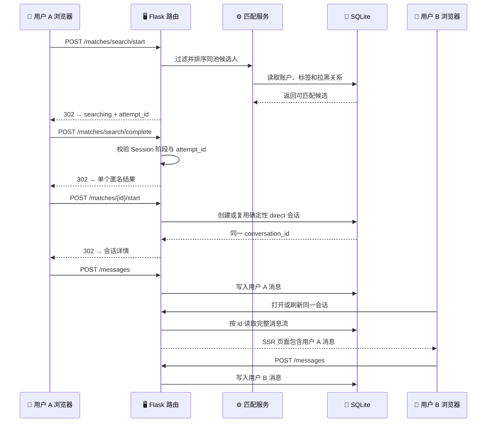
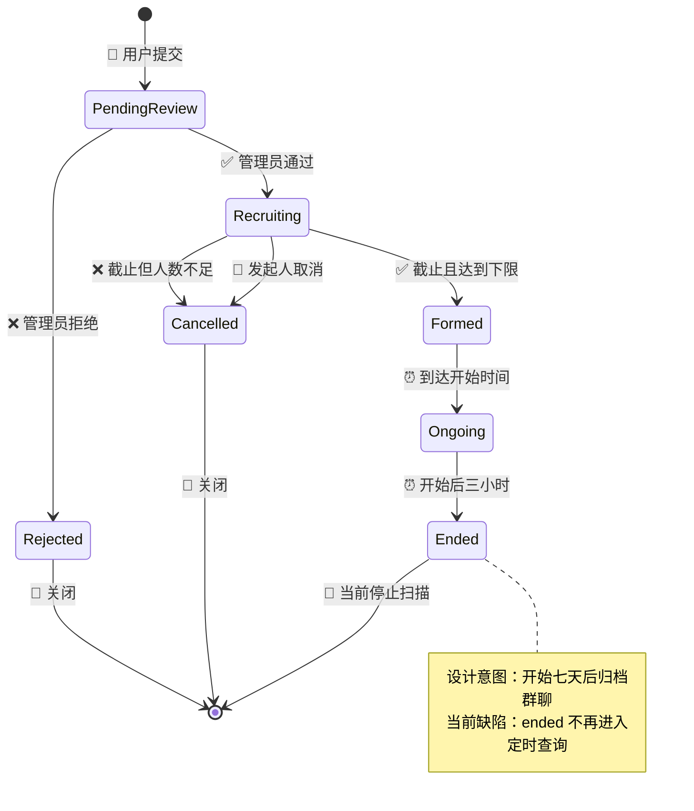
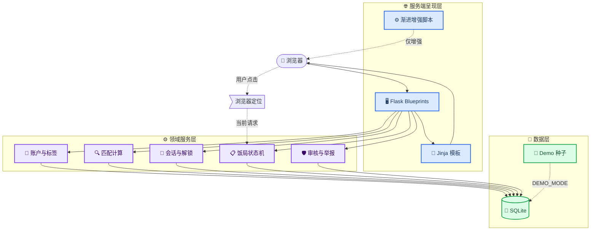

# 真实标签——同频


_TagPulse 工程代号 · Flask + Jinja2 服务端渲染社交产品 MVP · 文档基线 2026-08-23_

---

真实标签是一套“先验证同频，再逐步认识”的兴趣社交产品：用户以第三方行为标签参与匿名匹配，通过服务端生成的破冰任务推进关系，并可报名或发起 3–10 人的线下兴趣饭局。

> ⚠️ **交付结论：** 当前版本是可完整运行、可重复验证的黑客松/MVP 参考实现，适合本地演示、产品评审和工程接续；它尚未满足公开生产环境的安全、合规、实时通信与规模化运维要求。公开上线前必须完成 [生产缺口与上线路线图](docs/PRODUCTION_GAPS_AND_ROADMAP.md) 中的 P0 项。

| 维度 | 当前状态 |
| --- | --- |
| 页面架构 | Flask 多路由 + Jinja2 多模板 SSR |
| 前端形态 | 普通链接、HTML 表单、渐进增强 JavaScript |
| 持久化 | SQLite，启动时初始化并执行有限的加法迁移 |
| 真实用户链路 | 注册 → 匹配 → 唯一会话 → 双向持久化消息 |
| 饭局链路 | 创建 → 平台审核 → 报名 → 成团/取消 → 匿名群聊 |
| 管理能力 | 独立管理员登录、账户只读目录、活动/举报审核、审计日志 |
| 自动化验证 | 28 项 Python 测试 + 4 项 Node 动效状态测试 |
| 公开生产就绪 | **否，当前为 NO-GO** |
| 许可证 | [MIT](LICENSE) |

**文档导航**

- [项目总览](#-项目总览)
- [快速开始](#-快速开始)
- [产品能力与完整流程](#-产品能力与完整流程)
- [系统架构](#-系统架构)
- [路由与交互契约](#-路由与交互契约)
- [配置、数据与任务](#-配置数据与任务)
- [验证与质量门禁](#-验证与质量门禁)
- [部署与运维](#-部署与运维)
- [安全、隐私与生产边界](#-安全隐私与生产边界)
- [文档、协作与维护](#-文档协作与维护)

## 📋 项目总览

### 产品目标

传统社交资料主要依赖自我描述，匹配又常在照片、年龄和职业等信息上过早做横向比较。真实标签选择另一条路径：

1. 将行为数据标准化为带来源、认证状态和可见性的标签
2. 在匹配阶段只呈现单个匹配结果与展示分，不提供候选人资料
3. 在匿名会话中通过互动热度、活跃天数和任务逐步解锁信息
4. 以多人兴趣饭局作为低压力的线下关系出口
5. 让活动、举报和账户信息进入独立的管理员治理流程

### 当前实现范围

| 领域 | 已实现 | 当前边界 |
| --- | --- | --- |
| 账户 | 邮箱注册、密码哈希、登录/退出、匿名资料 | 无邮箱/手机验证、找回密码、注销与数据导出 |
| 数据连接 | Duolingo、Keep 适配器边界与标准化标签 | 两个来源均为确定性 Mock OAuth |
| 匿名匹配 | 双向性别偏好硬过滤、标签相似度、单结果流程 | 无互相接受、排队、在线状态或人工推荐运营 |
| 会话 | 唯一一对一会话、双向消息、任务卡、渐进解锁 | SSR 刷新可见，无 WebSocket/SSE 即时推送 |
| 安全操作 | 会话举报、拉黑、归档只读、成员鉴权 | 无自动处罚、申诉、风控评分或客服工单 |
| 饭局 | 白名单 POI、附近筛选、报名审核、状态机、群聊、权益 | 无真实地图、商家入驻、支付、POS 或到店核验 |
| 管理后台 | 独立管理员、账户目录、活动/举报审核、审计日志 | 无 RBAC、MFA、批量操作和处罚执行 |
| 视觉 | 响应式新粗野主义系统、移动底栏、减弱动画 | 尚无真实设备矩阵与浏览器自动化回归 |

### 明确不是

- 不是 SPA：没有 React、Vue、前端路由、Hash 路由或单一 `index.html`
- 不是 REST/GraphQL API 服务：当前对外契约是 HTML 页面、表单 POST、Flash 与 302 跳转
- 不是已接入生产第三方平台的真实数据聚合器：当前 OAuth 与标签返回为 Mock
- 不是即时通信系统：消息真实持久化，但需要对方进入或刷新服务端页面
- 不是已通过安全审计或隐私合规评审的线上服务
- 不是可直接承载高并发的生产架构

### 技术栈

| 层 | 技术 | 说明 |
| --- | --- | --- |
| Web | Flask 3.1 | 应用工厂、Blueprint、Session、CLI |
| 模板 | Jinja2 | 每个功能页独立模板，服务端输出完整 HTML |
| 数据 | Python `sqlite3` / SQLite | 单文件数据库、外键、参数化 SQL |
| 密码 | Werkzeug Security | `generate_password_hash` / `check_password_hash` |
| 前端 | HTML、CSS、原生 JavaScript | JavaScript 只做动效、Dialog 与定位增强 |
| 测试 | `unittest`、Flask `test_client`、Node `--test` | 不依赖 pytest 或浏览器测试框架 |
| 工程入口 | TagPulse Harness CLI | 零额外 Python 依赖的分阶段验证控制台 |

## 🚀 快速开始

### 先决条件

| 依赖 | 运行应用 | 完整 Harness | 当前验证版本 |
| --- | --- | --- | --- |
| Python | 必需 | 必需 | 最低 3.10；当前验证 3.12.10 |
| Flask | 必需 | 必需 | 3.1.0 |
| Node.js | 不需要 | 动效测试需要 | 24.18.0 |
| 现代浏览器 | 必需 | 不需要 | 支持 HTML Dialog；定位为可选增强 |
| Git | 推荐 | 推荐 | 用于获取代码与审阅变更 |

`requirements.txt` 仅声明 `Flask>=3.1,<4`。应用不依赖 npm 包，Node.js 只用于运行 `tests/match_flow.test.mjs`。

### Windows PowerShell

```powershell
git clone https://github.com/songconmaisaix31-design/xxx.git
Set-Location xxx

python -m venv .venv
.\.venv\Scripts\Activate.ps1
python -m pip install --upgrade pip
python -m pip install -r requirements.txt

python run.py
```

打开 `http://127.0.0.1:5000`。

如果 PowerShell 禁止激活脚本，可以直接调用虚拟环境解释器：

```powershell
.\.venv\Scripts\python.exe -m pip install -r requirements.txt
.\.venv\Scripts\python.exe run.py
```

### macOS 或 Linux

```bash
git clone https://github.com/songconmaisaix31-design/xxx.git
cd xxx

python3 -m venv .venv
source .venv/bin/activate
python -m pip install --upgrade pip
python -m pip install -r requirements.txt

python run.py
```

### 演示模式

默认 `DEMO_MODE=1`。首次启动会创建演示用户、演示管理员、行为标签、饭局、群聊和权益数据。

| 入口 | 账号 | 密码/授权码 |
| --- | --- | --- |
| 普通演示用户 | `demo@realtags.local` | `demo-password` |
| 演示管理员 | `admin@realtags.local` | `admin-password` |
| Mock 数据源授权 | Duolingo / Keep | `demo-authorized` |

也可以在首页或登录页使用“进入预置演示账号”。演示凭据仅应存在于本机演示环境。

> ⚠️ **数据库不会反向清理：** 将已有数据库从 `DEMO_MODE=1` 改为 `0`，不会删除已经写入的演示饭局。真实部署必须使用全新的生产数据库。

### 真实账户模式

真实模式关闭演示账户和演示快捷操作，但第三方数据源仍然是 Mock；“真实账户”在这里仅指普通注册账户，不代表身份已核验。

生成生产密钥：

```powershell
python -c "import secrets; print(secrets.token_hex(32))"
```

PowerShell：

```powershell
$env:DEMO_MODE="0"
$env:FLASK_SECRET_KEY="<替换为上一步生成的随机值>"

flask --app run.py create-admin
python run.py
```

Bash：

```bash
export DEMO_MODE=0
export FLASK_SECRET_KEY="<替换为上一步生成的随机值>"

flask --app run.py create-admin
python run.py
```

`python run.py` 仍然只是开发启动方式。真实互联网部署见 [部署与运维](#-部署与运维) 和 [P0 上线阻断项](docs/PRODUCTION_GAPS_AND_ROADMAP.md#-p0-上线阻断项)。

## 👤 产品能力与完整流程

### 身份与行为标签

注册会校验邮箱格式、密码长度、匿名代号、成年年龄、城市、性别、匹配偏好和枚举字段。成功后会创建 `is_demo=0` 的普通账户并立即建立登录 Session。

数据连接页通过统一的 `DataSourceAdapter` 边界处理外部来源：

1. 路由接收来源与授权码
2. 适配器验证授权并返回访问令牌
3. 适配器输出统一的 `ExternalTag`
4. 服务层替换该来源的旧标签
5. 标签以 `source`、`verified`、`visibility=self_only` 保存
6. 用户在“我的标签”页面查看来源与认证状态

当前 `duolingo` 和 `keep` 都使用 `MockDataSourceAdapter`。访问令牌与标签仅用于演示，不能被描述为真实平台授权。

### 匿名匹配与真实双向会话

匹配是服务端拥有的状态流程。浏览器动画不决定候选人、不计算分数，也不能直接创建会话。



关键保证：

- 候选池按 `is_demo` 隔离，真实用户不会匹配到演示用户
- 硬过滤要求双方成年且性别偏好互相兼容
- 已拉黑关系从候选池排除
- 行为标签、目的、兴趣、活跃时间、城市和 MBTI 仅在服务端参与计算
- 搜索阶段的 HTML 不包含候选人资料或匹配分
- 完成与创建会话都要求当前 Session 中的有效 `attempt_id`
- 旧页面、取消后的回调和伪造的候选 ID 不能建立会话
- 同一对用户以排序后的用户 ID 生成确定性会话 ID
- 双向并发创建使用 `INSERT OR IGNORE`，最终只保留一条 direct 会话
- 两名成员均可在会话列表和详情页看到同一条会话
- 消息按数据库自增 ID 排序并永久保存在当前 SQLite 文件中

> 📌 **通信语义：** 当前没有 WebSocket、SSE 或轮询。消息不是假数据，但接收方需要打开或刷新页面才能看到新内容。

### 渐进式关系解锁

| 阶段 | 对方可见信息 | 默认推进条件 |
| --- | --- | --- |
| L0 完全匿名 | 匿名代号 | 会话建立 |
| L1 初识 | 城市、年龄段 | 双方发言且互动热度达到阈值 |
| L2 熟悉 | 首个兴趣类别、模糊占位状态 | 双方都发过言，且任一方累计至少 3 个不同 UTC 发言日 |
| L3 熟络 | 兴趣列表、全部来源标签、清晰占位状态 | 双方都发过言，且任一方累计至少 7 个不同 UTC 发言日 |
| L4 走出产品 | 联系方式交换能力标志 | 匹配点全部解锁 |

当前没有真实头像、联系方式字段或交换工作流。L2/L3 的头像状态是产品占位语义，L4 只提供能力标志。

> ⚠️ **已知口径差异：** 当前代码不校验“连续天数”，也不要求双方各自达到 3/7 天；工具解锁还可被同一成员连续触发。这里描述的是实际代码条件，不是理想产品规则。修复标准见 `P1-03` 与 `P1-04`。

互动热度由普通消息和服务端系统任务共同形成。可用工具包括：

- 摇骰子：服务端随机产生 1–6 点和对应话题
- 任务卡：服务端从学习、运动、生活、脑洞、价值观题库抽取任务
- 匹配点：按双方共同目的、兴趣、行为标签和城市逐项解锁
- Demo 推进：`DEMO_MODE=1` 时可见，用于演示 L0–L4；当前没有进一步校验账户本身必须是 Demo，这是 P0 缺口

拉黑后双方历史转为只读，消息、工具和演示推进均在服务端拒绝；被拉黑的两人也不会再次进入候选池。

### 兴趣饭局

用户饭局必须从服务端白名单餐厅中选择，人数满足 `3 ≤ min_size ≤ max_size ≤ 10`，目标标签为 1–5 项，活动时间必须在未来且精确到半小时。



完整规则：

- 用户创建的活动先进入 `pending_review`，仅发起人和管理员可见
- 管理员通过后才进入 `recruiting` 并公开到饭局广场
- 商家活动目前仅由演示种子创建，不存在商家自助入口
- 广场可按城市、标签、预算、权益、时间、匹配度或距离筛选
- 浏览器定位只在用户点击后请求；坐标仅进入当前 GET 查询
- 服务端用 Haversine 公式计算到三个白名单 POI 的估算直线距离
- 报名支持先到先得或发起人审核
- 审核制仅向发起人提供申请编号、匹配分、共同标签数和内部操作 ID
- 同一用户不能重复报名，也不能报名时间重叠的活动
- 报名截止后达到下限则成团，否则取消
- 成团后为批准成员创建匿名群聊
- 群成员只暴露临时代号与最多两个兴趣标签
- 商家演示饭局成团后发放权益码，可执行手动核销
- `archived_at` 已存在且归档会话会转为只读；但正常进入 `ended` 后不会继续被定时查询，七天自动归档当前存在已知缺陷
- `gender_policy` 目前只保存、不参与报名或成团决策
- 发起人批准待审申请时尚未在事务内重新校验 `max_size`，并发或连续批准可能超员
- 演示权益核销只校验持有人、状态与字符串，不校验真实门店或活动时间窗

附近定位不是地图服务。当前没有地图瓦片、路线规划、动态 POI 搜索或地址反向解析。

### 管理员治理

管理员与普通用户使用不同的 `admin_id` Session 语义；登录任一身份时都会清空旧 Session，避免同一浏览器同时保留两类身份。

管理员工作台包含：

- 待审用户饭局队列
- 待处理举报队列
- 受限字段的注册账户只读目录与搜索
- 活动审核详情、拒绝原因和状态转换保护
- 举报处理/驳回、处理备注和重复处理保护
- 最近 20 条管理员审计日志

管理员账户目录只查询邮箱、匿名代号、城市、手机验证标志、演示类型、注册时间和已连接来源数量。`password_hash` 与 `access_token` 不在查询字段中。

真实模式不会创建默认管理员。使用：

```powershell
flask --app run.py create-admin
```

管理员密码至少 12 位，显示名为 2–40 个字符。

## ⚙️ 系统架构

### 总体结构



### 关键组件

| 组件 | 位置 | 责任 |
| --- | --- | --- |
| 应用工厂 | `app/__init__.py` | 创建 Flask、初始化实例目录、注册 Blueprint、CLI 与模板全局 |
| 配置 | `app/config.py` | 密钥、演示模式、最大请求体 |
| 数据库 | `app/db.py` | Schema、连接生命周期、有限迁移、演示种子 |
| 身份服务 | `app/services/users.py` | 注册、认证、Session 用户、标签与来源查询 |
| 数据适配器 | `app/services/adapters.py` | Mock OAuth、来源标签标准化、错误码 |
| 匹配服务 | `app/services/matching.py` | 硬过滤、相似度、候选排序、饭局匹配分 |
| 会话服务 | `app/services/chat.py` | 唯一会话、消息、解锁、任务、举报与拉黑 |
| 饭局服务 | `app/services/events.py` | POI、附近计算、报名、成团、群聊与权益 |
| 审核服务 | `app/services/moderation.py` | 管理员、活动/举报审核、账户目录、审计 |
| 路由层 | `app/routes/` | HTTP 方法、登录保护、PRG 跳转、模板渲染 |
| 模板层 | `app/templates/` | 独立页面与服务端状态呈现 |
| 静态层 | `app/static/` | 设计系统、页面 CSS、图片与渐进增强脚本 |
| Harness | `tools/harness_cli.py` | 运行时、语法、核心、专项与 E2E 编排 |

### 目录结构

```text
.
├── app/
│   ├── __init__.py
│   ├── config.py
│   ├── constants.py
│   ├── db.py
│   ├── routes/
│   │   ├── admin.py
│   │   ├── auth.py
│   │   ├── chat.py
│   │   ├── events.py
│   │   ├── main.py
│   │   └── matches.py
│   ├── services/
│   │   ├── adapters.py
│   │   ├── chat.py
│   │   ├── events.py
│   │   ├── matching.py
│   │   ├── moderation.py
│   │   └── users.py
│   ├── templates/
│   │   ├── base.html
│   │   ├── home.html
│   │   ├── profile.html
│   │   ├── match_*.html
│   │   ├── conversation*.html
│   │   ├── event*.html
│   │   └── admin_*.html
│   └── static/
│       ├── css/
│       ├── img/
│       ├── js/
│       └── qa/
├── docs/
│   ├── FRONTEND_HANDOFF.md
│   ├── HARNESS_CLI.md
│   ├── HARNESS_ENGINEERING.md
│   ├── PRODUCTION_GAPS_AND_ROADMAP.md
│   ├── design-audit/
│   └── qa/
├── tests/
├── tools/
│   └── harness_cli.py
├── instance/                 # 运行时数据库，已被 Git 忽略
├── harness.cmd
├── requirements.txt
└── run.py
```

### 架构决策

- **服务端拥有业务状态：** 匹配结果、任务随机数、解锁内容、活动状态和审核决定都由 Python 生成
- **模板应只接收允许展示的数据：** 这是目标边界；当前匹配详情上下文仍携带过宽候选对象，L3 也读取 `self_only` 标签，均已列为 P0
- **POST/Redirect/GET：** 写操作通过普通表单提交，Flash 反馈后 302 跳转
- **渐进增强：** 关闭 JavaScript 后，注册、匹配、聊天、报名和审核仍可完成
- **单数据库 MVP：** SQLite 降低本地运行成本，但不是长期高并发方案
- **适配器边界先行：** 路由不直接调用外部平台，真实 OAuth 可在不改变页面契约的前提下替换 Mock
- **设计系统分层：** 基础令牌、页面组件、手机重排和专项页面样式分文件维护

## 🔗 路由与交互契约

### 公共与账户路由

| 方法 | 路径 | 权限 | 作用 |
| --- | --- | --- | --- |
| GET | `/` | 公开 | 首页与登录用户统计 |
| GET/POST | `/register` | 访客 | 注册普通账户 |
| GET/POST | `/login` | 访客 | 普通用户登录 |
| POST | `/demo/login` | Demo | 进入预置演示用户 |
| POST | `/logout` | 公开 | 清空当前 Session |
| GET | `/profile` | 用户 | 查看本人资料与标签 |
| GET | `/profile/connections` | 用户 | 查看数据来源连接 |
| POST | `/profile/connections/<source>/authorize` | 用户 | Mock 授权并刷新来源标签 |

### 匹配路由

| 方法 | 路径 | 权限 | 作用 |
| --- | --- | --- | --- |
| GET | `/matches` | 用户 | 匹配准备页与候选数量 |
| POST | `/matches/search/start` | 用户 | 创建服务端匹配尝试 |
| GET | `/matches/searching` | 用户 | 三阶段计算过场 |
| POST | `/matches/search/complete` | 用户 | 校验 `attempt_id` 并确认结果 |
| POST | `/matches/search/cancel` | 用户 | 取消并失效当前尝试 |
| POST | `/matches/search/retry` | 用户 | 换一位并生成新尝试 |
| GET | `/matches/<candidate_id>` | 用户 | 单个匿名匹配结果 |
| POST | `/matches/<candidate_id>/start` | 用户 | 基于有效结果创建/复用 direct 会话 |

### 会话路由

| 方法 | 路径 | 权限 | 作用 |
| --- | --- | --- | --- |
| GET | `/conversations` | 用户 | 当前用户会话列表 |
| GET | `/conversations/<conversation_id>` | 成员 | 会话详情与完整消息流 |
| POST | `/conversations/<conversation_id>/messages` | 可互动成员 | 发送 1–500 字消息 |
| POST | `/conversations/<conversation_id>/tools/<tool>` | 可互动成员 | 使用 `dice`、`task_card`、`unlock` |
| POST | `/conversations/<conversation_id>/demo/advance` | Demo 模式下的成员 | 演示推进关系阶段；当前未校验账户类型 |
| POST | `/conversations/<conversation_id>/report` | 成员 | 举报会话 |
| POST | `/conversations/<conversation_id>/block` | direct 成员 | 拉黑对方并终止互动 |

“可互动”要求会话未归档、未跨真实/演示池、双方未拉黑且当前用户为成员。模板隐藏控件只是呈现优化，服务层会再次校验。

### 饭局路由

| 方法 | 路径 | 权限 | 作用 |
| --- | --- | --- | --- |
| GET | `/events` | 用户 | 广场、筛选与附近模式 |
| GET/POST | `/events/new` | 用户 | 创建待审核活动 |
| GET | `/events/<event_id>` | 可见用户 | 饭局详情 |
| POST | `/events/<event_id>/signup` | 用户 | 报名 |
| POST | `/events/<event_id>/review/<applicant_id>/<decision>` | 发起人 | 通过/拒绝匿名申请 |
| POST | `/events/<event_id>/cancel` | 发起人 | 取消草稿或招募中活动 |
| POST | `/events/<event_id>/demo/settle` | Demo 发起人 | 演示立即成团/取消 |
| POST | `/events/<event_id>/redeem` | 权益持有人 | 手动核销演示权益 |
| POST | `/events/<event_id>/report` | 用户 | 举报活动 |

附近筛选参数：

| 参数 | 规则 |
| --- | --- |
| `lat` / `lng` | 必须同时存在；纬度 `[-90, 90]`，经度 `[-180, 180]` |
| `accuracy` | 可选，`0–100000` 米 |
| `radius` | 大于 0 且不超过 50 km；默认 5 km |
| `sort` | `match`、`time`；定位有效时支持 `distance` |
| `city` / `tag` / `budget` / `benefit` | 服务端白名单筛选 |

### 管理员路由

| 方法 | 路径 | 权限 | 作用 |
| --- | --- | --- | --- |
| GET/POST | `/admin/login` | 访客 | 管理员登录 |
| POST | `/admin/logout` | 管理员 | 退出后台 |
| GET | `/admin/` | 管理员 | 队列、账户目录与审计日志 |
| GET | `/admin/?q=<query>` | 管理员 | 按邮箱、匿名代号或城市搜索 |
| GET | `/admin/events/<event_id>` | 管理员 | 活动审核详情 |
| POST | `/admin/events/<event_id>/review` | 管理员 | `approve` / `reject` |
| GET | `/admin/reports/<report_id>` | 管理员 | 举报处理详情 |
| POST | `/admin/reports/<report_id>/review` | 管理员 | `resolved` / `dismissed` |

当前没有 JSON API、OpenAPI 文档、API Token 或跨应用客户端契约。新增 API 前必须复用现有服务层权限，不得从模板逻辑复制业务规则。

## 💾 配置、数据与任务

### 环境变量

| 变量 | 默认值 | 生产要求 | 说明 |
| --- | --- | --- | --- |
| `FLASK_SECRET_KEY` | `dev-only-change-me` | 必须替换 | Flask 签名 Session 密钥 |
| `DEMO_MODE` | `1` | 必须为 `0` | 控制种子数据、演示登录和快捷操作 |

当前 `Config` 没有从环境变量读取数据库路径。`DATABASE` 是 Flask 应用配置键，默认在应用工厂中设置为 `instance/realtags.sqlite3`。如果部署需要外部路径，必须通过自定义配置类或补充显式环境映射；不能假设 `DATABASE_URL` 已受支持。

### 应用配置

| 键 | 当前值 | 说明 |
| --- | --- | --- |
| `SECRET_KEY` | 来自 `FLASK_SECRET_KEY` | 未设置时使用不安全的开发默认值 |
| `DEMO_MODE` | 环境值是否等于 `1` | 默认为开启 |
| `MAX_CONTENT_LENGTH` | 1 MiB | 整个请求体上限 |
| `DATABASE` | `instance/realtags.sqlite3` | 由应用工厂 `setdefault` |

### 数据模型

| 表 | 主体 | 关键关系/用途 |
| --- | --- | --- |
| `users` | 用户 | 邮箱、密码哈希、匿名资料、偏好、`is_demo` |
| `external_connections` | 外部连接 | 每用户每来源一条；当前保存 Mock Token |
| `tags` | 行为标签 | 用户、来源、认证、可见性与 JSON 值 |
| `events` | 饭局 | 发起方、POI、人数、时间、标签、状态与权益 |
| `event_members` | 饭局成员 | 角色、报名状态、匹配分、共同标签数、签到标志 |
| `conversations` | 会话 | direct/event_group、饭局关联、演示进度、归档时间 |
| `conversation_members` | 会话成员 | 用户与群匿名代号 |
| `messages` | 消息 | text/system_card、正文、白名单元数据 |
| `event_coupons` | 饭局权益 | 持有人、权益 JSON、核销码与状态 |
| `admins` | 管理员 | 独立邮箱、密码哈希、显示名与启用状态 |
| `reports` | 举报 | 举报人、对象、原因、处理人、状态与备注 |
| `event_reviews` | 活动审核 | 提交、审核人、决定、拒绝原因与时间 |
| `admin_audit_logs` | 管理审计 | 动作、对象、旧/新状态与备注 |
| `blocks` | 拉黑关系 | 有方向的 blocker/blocked 唯一关系 |

JSON 字段包括用途、兴趣、标签值、活动目标标签、消息元数据和商家权益。所有 SQL 值使用参数绑定；动态 SQL 只用于服务端固定字段或受限条件。

### 初始化、迁移与种子

应用启动时：

1. 创建 `instance/`
2. 打开 SQLite 并启用外键
3. 执行幂等 `CREATE TABLE IF NOT EXISTS` Schema
4. 为旧库添加 `users.is_demo` 和举报处理字段
5. 创建缺失索引
6. 在 Demo 模式下创建演示管理员与产品数据

这不是版本化迁移系统。没有迁移版本表、回滚脚本、离线迁移流程或生产升级演练；该项属于 P0 数据治理缺口。

### Flask CLI

| 命令 | 是否修改数据 | 作用 |
| --- | --- | --- |
| `flask --app run.py create-admin` | 是 | 交互式创建真实管理员 |
| `flask --app run.py process-events` | 是 | 推进到期饭局；群聊七天归档当前有已知缺陷 |

`process-events` 与请求前检查调用同一个 `refresh_event_statuses`。开发环境每次请求都会推进状态；生产仍必须有独立调度器，避免无访问流量时状态停滞。

建议调度周期：最多 5 分钟一次。当前仓库没有 Cron、Windows Task Scheduler、容器任务或云平台定时任务配置。

### TagPulse Harness CLI

Windows：

```powershell
.\harness.cmd [command] [options]
```

跨平台：

```bash
python tools/harness_cli.py [command] [options]
```

| 子命令 | 作用 | 是否写本地业务库 |
| --- | --- | --- |
| 默认 / `run` | 完整验证管道 | 否 |
| `run --suite core` | 核心、专项与动效检查 | 否 |
| `run --suite e2e` | 完整 HTTP 产品旅程 | 否 |
| `flow` | `e2e` 的快捷入口 | 否 |
| `doctor` | Flask 导入与 Python 语法 | 否 |
| `map` | 输出产品旅程覆盖图 | 否 |
| `serve` | 启动开发服务器 | 会使用本地库 |
| `scheduler` | 显式推进本地饭局 | **是** |

通用选项：

- `--verbose`：显示成功阶段的原始输出
- `--fail-fast`：首个失败后停止
- `--no-color`：关闭 ANSI 色彩，适合 CI 日志

## 🧪 验证与质量门禁

### 一键验证

```powershell
.\harness.cmd --no-color
```

管道顺序：

```text
Preflight → Syntax → Match motion → Core checks → Feature checks → E2E harness
```

最近一次完整验证：

```text
VERIFIED  6/6 gates passed  /  exit 0
23 unit/SSR checks + 4 motion checks / 5 product journeys
```

### 直接运行测试

```powershell
# 全部 Python 测试
python -m unittest discover -s tests -v

# 仅完整产品旅程
python -m unittest discover -s tests -p "test_e2e_harness.py" -v

# 匹配动效状态机
node --test tests/match_flow.test.mjs

# Python 语法检查
python -m compileall -q app tests
```

### 覆盖矩阵

| 文件 | 数量 | 主要覆盖 |
| --- | ---: | --- |
| `tests/test_core.py` | 9 | SSR 页面、匹配竞态、L0 隐私、唯一会话、Demo 隔离、状态结算、CLI |
| `tests/test_admin_moderation.py` | 7 | 管理员认证、账户白名单、活动审核、举报、审计、旧库迁移 |
| `tests/test_chat_ui.py` | 2 | 系统卡白名单、表单契约、归档与拉黑只读 |
| `tests/test_nearby_events.py` | 5 | 坐标、半径、距离排序、定位降级与非持久化 |
| `tests/test_e2e_harness.py` | 5 | 注册授权、匿名匹配、真实双向会话、C/B 端饭局 |
| `tests/match_flow.test.mjs` | 4 | 时间线、取消、重试、减弱动画 |

E2E 使用临时 SQLite 和 Flask `test_client()`，验证真实 GET/POST、Session、表单、302、SSR HTML 与数据库终态，不修改 `instance/realtags.sqlite3`。

真实账户链路的 E2E 会：

1. 在 `DEMO_MODE=False` 创建两个新注册账户
2. 确认没有演示账户或演示管理员种子
3. 确认双方候选池只能看到对方
4. 拒绝伪造的 `attempt_id`
5. 建立唯一 direct 会话
6. 让双方分别发送消息
7. 确认双方页面可读到完整消息
8. 验证非成员不能举报
9. 验证拉黑后新消息不落库

### 当前未覆盖

- 真实浏览器 E2E、跨浏览器与真实手机设备
- WebSocket/SSE，因为当前没有该能力
- 真实 OAuth、地图、短信、邮件、支付、POS 和通知供应商
- 并发多进程调度器与生产数据库
- 渗透测试、依赖漏洞扫描、SAST/DAST
- WCAG 自动化与人工读屏验收
- 压力、容量、恢复和灾难演练

这些不是测试遗漏的“已实现功能”，而是尚未建设的生产能力。

## 📦 部署与运维

### 环境适用性

| 环境 | 结论 | 条件 |
| --- | --- | --- |
| 本地开发 | GO | 可使用 Demo 模式 |
| 自动化测试 | GO | 使用临时 SQLite |
| 产品/设计评审 | GO | 不输入真实敏感数据 |
| 内部封闭演示 | GO | 受信网络、演示账号 |
| 真实用户封闭试点 | NO-GO | 先完成适用的全部 P0 |
| 公开互联网生产 | **NO-GO** | 完成全部 P0、审计与演练 |

### 当前开发启动

`run.py` 创建应用并调用 `app.run()`。调试器默认关闭，但 Flask 开发服务器仍不适合公网。

当前仓库没有：

- 生产 WSGI Server 依赖
- Dockerfile 或容器镜像
- 反向代理配置
- TLS/HTTPS 配置
- 进程管理配置
- 健康检查端点
- 日志聚合、指标与告警
- CI/CD 工作流
- 依赖锁定文件

因此 README 不提供“直接上线”命令。生产团队必须先完成 [部署与可观测性缺口](docs/PRODUCTION_GAPS_AND_ROADMAP.md#部署与可观测性)。

### 定时任务

生产调度器至少每 5 分钟执行：

```powershell
flask --app run.py process-events
```

该命令负责：

- 招募截止时按批准人数成团或取消
- 到开始时间时进入进行中
- 开始三小时后结束
- 设计上应在活动开始七天后归档群聊；当前正常 `ended` 状态不会被后续扫描，需先修复 P1-05
- 成团时创建匿名群聊并发放演示商家权益

当前并发调度锁、分布式幂等和失败重试仍是缺口。不要同时启动多个无协调的调度实例。

### SQLite 备份与恢复

当前只建议离线备份：

1. 停止 Web 进程和 `process-events` 调度
2. 复制 `instance/realtags.sqlite3` 到受控、加密、带时间戳的位置
3. 验证备份文件存在且大小非零
4. 在隔离环境执行恢复演练
5. 恢复时保持应用停止，替换数据库后再启动并运行 Harness

> ⚠️ **不要在持续写入时直接复制数据库文件。** 当前项目未启用在线备份封装、WAL 运维策略、自动快照或恢复校验。

生产前必须定义 RPO、RTO、保留周期、加密、访问控制与恢复演练频率。

### 发布前最低清单

- [ ] `DEMO_MODE=0`，使用全新数据库
- [ ] 删除任何演示凭据与 Mock 外部连接
- [ ] 使用密钥管理系统注入随机 `FLASK_SECRET_KEY`
- [ ] 完成全部 P0 安全与隐私项
- [ ] 引入生产 WSGI、HTTPS 与受信代理配置
- [ ] 建立版本化迁移和回滚流程
- [ ] 建立自动备份并成功完成恢复演练
- [ ] 部署唯一或协调后的活动调度器
- [ ] 建立健康检查、结构化日志、指标和告警
- [ ] 建立 CI/CD 并运行完整 Harness
- [ ] 完成真实 OAuth、通知、地图等供应商沙箱验收
- [ ] 完成安全、隐私、内容治理和线下活动安全评审

## 🔐 安全、隐私与生产边界

### 已实现的保护

| 控制 | 当前实现 |
| --- | --- |
| 密码存储 | Werkzeug 自适应密码哈希，不保存明文 |
| Session 切换 | 登录时清空旧 Session；Demo 关闭后演示 Session 失效 |
| SQL 输入 | 查询值使用参数绑定 |
| 模板文本 | Jinja 默认转义；业务模板不使用用户文本 `safe` |
| 匹配状态 | Session 阶段、随机 `attempt_id`、常量时间比较 |
| 候选隔离 | 真实/演示池隔离；双向偏好与拉黑过滤 |
| 会话授权 | 成员检查；归档、跨池与拉黑会话只读 |
| 匿名裁剪 | 服务层决定 L0–L4 可见字段 |
| 饭局审核 | 待审活动不公开；报名审核不返回身份资料 |
| 定位最小化 | 坐标不写账户、Session 或数据库；但当前仍位于 GET URL |
| 管理员查询 | 显式字段白名单，不读取密码哈希和连接 Token |
| 状态审计 | 活动与举报决定写入管理员审计日志 |

### 信息可见性

| 场景 | 可见 | 不可见 |
| --- | --- | --- |
| 匹配计算中 | 三阶段进度文案 | 候选 ID、资料、分数、算法权重 |
| 匹配结果 | 展示分、共同点数量 | 照片、年龄、城市、职业、标签明细 |
| direct L0 | 匿名代号、会话任务 | 城市、年龄、兴趣、标签 |
| direct L1–L2 | 按阶段裁剪的信息 | 未到阶段的全部字段 |
| direct L3 | 兴趣与全部来源标签 | 当前未执行 `visibility=self_only`，属于 P0 缺口 |
| 饭局广场 | 活动、人数、性别聚合、标签、匹配分 | 成员名单与成员资料 |
| 报名审核 | 申请序号、匹配分、共同标签数 | 姓名、邮箱、照片、年龄、性别 |
| 群聊 | 临时代号、最多两个兴趣 | 真实身份与完整标签 |
| 管理员账户目录 | 受限账户元数据 | 密码哈希、访问令牌 |

### 仍然阻断生产的缺口

以下能力尚未实现：

- CSRF 防护
- 登录、注册、消息、举报与管理员操作限流
- 生产 Cookie、安全响应头、CSP 与受信代理配置
- 真实 OAuth `state`/PKCE、Token 加密、撤销与刷新
- 邮箱/手机号验证、密码找回、账户注销、数据导出与删除
- 管理员 MFA、RBAC、登录审计与强制会话过期
- 用户停用、活动下架、内容屏蔽、处罚与申诉闭环
- 隐私同意、服务条款、数据保留和未成年人策略
- URL 中定位参数的日志/历史最小化方案
- 安全监控、入侵检测、漏洞扫描与事件响应
- 真实线下活动主体、餐厅和商家验证

详见 [生产缺口与上线路线图](docs/PRODUCTION_GAPS_AND_ROADMAP.md)。在这些缺口关闭前，不应处理真实第三方访问令牌、真实联系方式、支付数据或公开线下活动。

### 威胁边界

- Flask 签名 Session 能防止客户端直接篡改，但不能替代 HTTPS、Cookie 策略或服务端 Session 治理
- Jinja 转义降低 HTML 注入风险，但不能替代 CSP、输入策略和安全测试
- 参数化 SQL 降低 SQL 注入风险，但不能替代最小权限、审计和数据库隔离
- “坐标不落库”不代表无痕：查询字符串仍可能进入浏览器历史、代理或访问日志
- 举报记录不等于治理完成：当前管理员决定不会自动停用用户或删除内容
- `phone_verified` 与 `checked_in` 字段存在，但当前没有真实验证流程

## 📚 文档、协作与维护

### 文档索引

| 文档 | 读者 | 定位 |
| --- | --- | --- |
| [产品需求文档](产品需求文档_PRD.md) | 产品、设计、研发 | 原始产品愿景；不代表全部已实现 |
| [品牌与界面规范](brand-spec.md) | 设计、前端 | 视觉令牌、组件与移动规则 |
| [前端交接文档](docs/FRONTEND_HANDOFF.md) | 前端、后端 | 模板变量、表单字段、视觉契约 |
| [Harness Engineering](docs/HARNESS_ENGINEERING.md) | 测试、研发 | 完整产品旅程与失败定位 |
| [TagPulse CLI](docs/HARNESS_CLI.md) | 研发、CI | Harness 子命令与安全边界 |
| [生产缺口与路线图](docs/PRODUCTION_GAPS_AND_ROADMAP.md) | 技术负责人、产品、安全、运维 | NO-GO 判断、P0–P3 与验收门 |
| [图像资产提示词](docs/IMAGE_ASSET_PROMPTS.md) | 设计 | 当前图片资产生成说明 |
| [设计 QA](design-qa.md) | 设计、前端 | 视觉验收记录与截图证据 |
| `prototype.html` / `prototype2.0.html` | 产品、设计 | 历史流程参考，不参与运行时 |

当文档与代码不一致时：

1. 运行时行为以代码与测试为事实来源
2. README 描述当前整体交付
3. 前端契约以 `docs/FRONTEND_HANDOFF.md` 为细节来源
4. PRD 与 Prototype 只表达需求和设计输入
5. 发现差异时必须在同一变更中更新文档与 Harness

### 常见问题

#### 启动时报 `ModuleNotFoundError: flask`

确认虚拟环境已激活并执行：

```powershell
python -m pip install -r requirements.txt
```

#### Harness 在 Match motion 阶段提示找不到 Node

应用本身不需要 Node。安装 Node 后运行完整 Harness，或先运行 Python 测试：

```powershell
python -m unittest discover -s tests -v
```

#### 注册了账户但没有候选人

至少需要另一个同为真实或同为演示池的账户，并满足双方性别偏好。拉黑关系也会让候选人被排除。创建两个普通账户后重新访问 `/matches`。

#### 匹配结果提示已失效

当前结果与 Session 中的 `attempt_id` 不一致，通常来自取消、换一位、旧标签页或重复提交。返回 `/matches` 重新开始。

#### 对方没有立即看到消息

当前是 SSR 持久化会话，不是实时推送。对方需要进入或刷新会话页。

#### 真实模式无法使用演示管理员

这是预期行为。`DEMO_MODE=0` 会拒绝演示管理员，请执行：

```powershell
flask --app run.py create-admin
```

#### 饭局没有按时间自动成团

开发访问会触发一次状态检查；无流量时必须显式运行：

```powershell
flask --app run.py process-events
```

生产环境需要独立定时调度。

#### 附近定位失败

定位必须由用户点击触发，浏览器可能要求 HTTPS 或本地安全上下文。拒绝权限后可继续使用城市和全部活动筛选。

#### 切换到真实模式后仍看到演示饭局

`DEMO_MODE=0` 不删除旧数据。停止应用，备份旧库，并使用全新的生产数据库；不要复用开发 Demo 数据库。

#### 出现 `database is locked`

停止重复的开发服务器或调度进程，确认没有同时写同一个 SQLite 文件。该现象也是迁移到生产数据库和协调任务调度的信号。

### 贡献流程

1. 从 `main` 创建短生命周期分支
2. 先阅读受影响的路由、服务、模板和全部调用方
3. 复用现有服务边界，不在模板或 JavaScript 复制业务规则
4. 为非平凡逻辑增加最小、可执行的回归测试
5. 运行 `.\harness.cmd --no-color`
6. 更新 README、前端契约或缺口文档中受影响的事实
7. 提交包含目的、风险、验证证据和回滚说明的变更

代码约束：

- 保持 Flask + Jinja2 多页面 SSR
- 页面跳转使用 `<a href>` 或 `url_for()`
- 写操作使用普通 POST 表单和 PRG
- 不加入 SPA、前端路由或单一入口 HTML
- 不把隐藏资料、原始匹配分或算法配置序列化到 DOM
- 不用客户端状态替代服务端权限和状态机
- 不为单次需求引入抽象或依赖
- 所有新增 P0 流程进入 Harness

### 许可证与上游资料
张晨真帅
本项目使用 [MIT License](LICENSE)。

- [Flask 官方文档](https://flask.palletsprojects.com/)
- [Jinja 官方文档](https://jinja.palletsprojects.com/)
- [Python `sqlite3` 文档](https://docs.python.org/3/library/sqlite3.html)
- [SQLite 官方文档](https://www.sqlite.org/docs.html)
- [Mermaid 官方文档](https://mermaid.js.org/)

---

_最后更新：2026-08-23 · 当前代码库：`songconmaisaix31-design/xxx` · 文档维护原则：代码、测试和文档同一变更同步_
