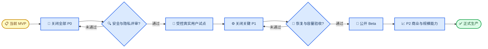

# 真实标签：生产缺口与上线路线图

_面向产品负责人、技术负责人、安全、隐私、测试与运维 · 基线 2026-08-23_

---

本文件记录代码库当前已经具备的工程基础、已确认缺口、公开上线门槛和可验证的完成标准。它不是愿望清单，也不把“有页面”“有字段”当成“能力已经闭环”。

> ⚠️ **发布判断：** 本地演示、自动化验证和受控产品评审为 GO；任何包含真实第三方授权、真实联系方式、公开陌生人匹配或线下活动的环境当前均为 **NO-GO**。

## 📋 评估范围与结论

### 评估基线

| 项目 | 基线 |
| --- | --- |
| 代码架构 | Flask + Jinja2 多页面 SSR |
| 数据库 | SQLite 单文件 |
| 自动化 | 28 项 Python + 4 项 Node 测试 |
| 最近验证 | Harness 6/6 Gates |
| 评估方式 | 路由、服务、Schema、模板、脚本与测试只读审计 |
| 生产定义 | 公网可访问并处理真实用户或真实个人数据 |

### 发布环境判断

| 环境 | 决策 | 允许的数据 | 前置条件 |
| --- | --- | --- | --- |
| 本地开发 | GO | 演示/合成数据 | 默认配置即可 |
| 自动化测试 | GO | 临时测试数据 | 使用测试临时库 |
| 设计与产品评审 | GO | 演示/合成数据 | 不输入真实隐私数据 |
| 内部受控演示 | GO | 演示/合成数据 | 受信网络、限制访问 |
| 真实用户封闭试点 | NO-GO | 无 | 完成适用的全部 P0 |
| 公开 Beta | NO-GO | 无 | 全部 P0 + 关键 P1 |
| 正式生产 | NO-GO | 无 | 全部 P0/P1、审计与恢复演练 |

### 优先级定义

| 等级 | 定义 | 发布规则 |
| --- | --- | --- |
| P0 | 安全、隐私、数据完整性或线下人身安全阻断 | 公开或真实数据环境前全部关闭 |
| P1 | 可靠性、可运营性和核心体验缺口 | 公测前关闭，受控试点需逐项豁免 |
| P2 | 商业闭环、产品完整性和规模效率 | 正式版前按范围关闭 |
| P3 | 长期优化、实验与多端能力 | 进入持续演进 Backlog |

不在本文件中给出日历工期。工期取决于团队规模、供应商、合规地区、目标并发和基础设施选型；在这些输入确定前给出精确周数会制造虚假确定性。

## ✅ 已具备的工程基础

| 领域 | 已实现基础 | 代码证据 | 测试证据 |
| --- | --- | --- | --- |
| 密码 | Werkzeug 哈希校验 | `app/services/users.py` | `test_core.py` |
| SSR | 独立路由与 Jinja 模板 | `app/routes/`、`app/templates/` | `test_core.py` |
| 匹配状态 | Session Phase + 随机 Attempt | `app/routes/matches.py` | Core + E2E |
| 候选隔离 | Demo/真实池、拉黑、双向偏好 | `app/services/matching.py` | Core + E2E |
| 唯一会话 | 确定性 ID、双向复用 | `app/services/chat.py` | Core + E2E |
| 消息持久化 | 双方写入同一会话 | `app/services/chat.py` | Real-user E2E |
| 会话权限 | 成员、归档、跨池、拉黑校验 | `app/services/chat.py` | Chat + E2E |
| 活动审核 | 待审不公开、决定带审计 | `app/services/moderation.py` | Admin + E2E |
| 匿名报名 | 发起人仅见聚合信号 | `app/services/events.py` | Event E2E |
| 定位最小化 | 请求期坐标、不写数据库 | `app/services/events.py` | Nearby Tests |
| 管理字段白名单 | 不查询密码与 Token | `app/services/moderation.py` | Admin Tests |
| 自动化入口 | 分阶段 Harness 与临时库 | `tools/harness_cli.py` | Harness 6/6 |

这些基础降低了后续建设成本，但不能替代生产安全控制。例如“密码已哈希”不能抵消已知默认 Session 密钥，“有举报表”也不等于已经具备处罚和申诉能力。

## ⚠️ 缺口总表

### P0 上线阻断

| ID | 缺口 | 当前风险 | 主要责任域 |
| --- | --- | --- | --- |
| P0-01 | 生产配置不 Fail-Closed | 已知密钥与 Demo 管理员可导致 Session 伪造 | Backend / Security |
| P0-02 | 无 CSRF | 所有状态写入可被跨站触发 | Backend / Security |
| P0-03 | Mock OAuth 与明文 Token | 无法证明标签真实，Token 泄露风险 | Backend / Security |
| P0-04 | 身份、账户与隐私生命周期缺失 | 无验证、同意、导出、删除与保留策略 | Product / Legal / Backend |
| P0-05 | 管理员与认证加固不足 | 无 MFA、RBAC、限流与登录审计 | Security / Backend |
| P0-06 | 内容治理没有执行闭环 | 举报完成不产生处置，缺少反滥用 | Trust & Safety |
| P0-07 | 线下活动安全控制不足 | 自报年龄、未验手机/主体、策略未执行 | Product / Safety |
| P0-08 | 无生产部署与可观测性 | 无 WSGI、HTTPS、健康检查、告警和响应 | Platform / SRE |
| P0-09 | 数据迁移、调度与恢复不可靠 | 无版本迁移、并发锁、在线备份和恢复证据 | Data / Platform |
| P0-10 | 隐私契约与实际披露不一致 | `self_only` 标签会在 L3 返回给对方 | Product / Privacy |

### P1 公测前关键项

| ID | 缺口 | 影响 |
| --- | --- | --- |
| P1-01 | 无实时消息、已读、在线状态 | 对话需要手动刷新 |
| P1-02 | 消息全量加载、无分页 | 长会话页面与查询持续膨胀 |
| P1-03 | 关系天数口径错误 | 取任一人的最大活跃日，且不要求连续 |
| P1-04 | 解锁无门槛 | 重复点击可直接解锁至 L4 |
| P1-05 | 群聊正常归档存在缺陷 | `ended` 不再进入定时查询 |
| P1-06 | 报名审批可超过人数上限 | 批准时未重新校验容量 |
| P1-07 | 性别构成策略只保存不执行 | `gender_policy` 不影响报名/成团 |
| P1-08 | 饭局标签映射不完整 | 阅读、美食等匹配分可能偏低 |
| P1-09 | 匹配点数量口径不一致 | 结果页与会话解锁数量可能不同 |
| P1-10 | 无通知系统 | 匹配、消息、审核和成团无提醒 |
| P1-11 | 无 CI/CD 与依赖安全门 | 回归和漏洞检查依赖人工执行 |
| P1-12 | 无真实浏览器/无障碍回归 | 交互、读屏和跨浏览器风险未量化 |
| P1-13 | 精确位置进入 GET URL | 浏览器历史、Referer 与访问日志可能留存坐标 |
| P1-14 | 匿名申请使用稳定用户 ID | 发起人可跨活动关联同一申请者 |
| P1-15 | Harness 与文档存在漂移 | 前置条件、写库边界和链接可能误导接手者 |

### P2/P3 产品与商业项

| 等级 | 能力 | 当前状态 |
| --- | --- | --- |
| P2 | 商家注册、认证与后台 | 仅演示种子 |
| P2 | 真实 POI、地图、路线 | 三个静态上海 POI |
| P2 | 支付、POS、券验证 | 静态字符串手动核销 |
| P2 | 到店签到与信誉 | 字段存在，无业务流程 |
| P2 | 联系方式双向同意交换 | 只有 L4 能力提示 |
| P2 | 活动后评价与申诉 | 未实现 |
| P2 | 饭局群成员转一对一 | PRD 有意图，无路由 |
| P2 | 邮件、短信、Push 通知 | 未实现 |
| P2 | 媒体、语音与附件 | 未实现 |
| P3 | 国际化与时区体系 | 固定中文与部分 UTC/+08 逻辑 |
| P3 | 隐私安全的产品分析 | 未实现 |
| P3 | 推荐实验与特征平台 | 常量配置 |
| P3 | 原生移动端与离线能力 | 未实现 |

## 🔐 P0 上线阻断项

### P0-01 生产配置必须 Fail-Closed

**当前状态**

- `FLASK_SECRET_KEY` 未设置时固定为 `dev-only-change-me`
- `DEMO_MODE` 默认开启
- Demo 模式会播种已知管理员 `admin@realtags.local / admin-password`
- Flask 客户端 Session 由 `SECRET_KEY` 签名
- 应用没有显式“生产环境”配置或启动自检

**风险**

如果公网实例误用默认值，攻击者可利用已知 Session 密钥伪造包含 `admin_id=admin_demo` 的 Session，并访问管理员能力。即使没有利用，Demo 账号和数据进入生产也会污染真实候选池、审核队列与产品指标。

**必须交付**

1. 将 Demo 模式改为明确 opt-in，默认关闭
2. 生产启动时拒绝默认、空或过短的密钥
3. 生产启动时拒绝已知 Demo 管理员与演示用户
4. 将环境模式、密钥和数据库位置纳入可审计配置
5. 建立密钥轮换和失效全部 Session 的操作流程

**验收标准**

- [ ] 未设置生产密钥时进程启动失败并输出不含密钥的错误
- [ ] 生产配置无法启用 `/demo/login` 和 Demo 推进路由
- [ ] 已知 Demo Session 在生产配置下无法认证
- [ ] 自动化测试覆盖默认值、短密钥和 Demo 污染数据库
- [ ] 密钥仅来自平台 Secret Manager，不进入仓库、镜像或日志

### P0-02 所有状态写入必须具备 CSRF 防护

**当前状态**

注册、登录、消息、工具、匹配、举报、拉黑、活动、核销和管理员决定均为普通 POST，但没有 CSRF Token 或 Origin 校验。

**风险**

登录用户访问恶意站点时，浏览器可能携带现有 Cookie 提交跨站表单，导致拉黑、举报、取消活动、管理员审核等未经本人确认的状态变化。

**必须交付**

1. 为所有 POST 表单生成与 Session 绑定的 CSRF Token
2. 对无 Token、错误 Token、过期 Token 统一拒绝
3. 对管理员与高风险操作增加 Origin/Referer 辅助校验
4. 保留无 JavaScript表单流程
5. 在错误页中避免泄露 Token 或 Session 内容

**验收标准**

- [ ] 每个写路由都有合法 Token 成功用例
- [ ] 缺失、错误、跨 Session Token 返回 `400` 或 `403`
- [ ] 无效请求不改变数据库
- [ ] 普通用户和管理员表单均覆盖
- [ ] Harness 中包含至少一个跨站模拟负例

### P0-03 替换 Mock OAuth 并保护凭据

**当前状态**

- Duolingo/Keep 均为 `MockDataSourceAdapter`
- 授权码固定为 `demo-authorized`
- `access_token` 以明文写入 SQLite
- 无 OAuth Callback、`state`、PKCE、刷新、撤销或断开

**风险**

核心“真实行为标签”价值尚未成立。真实 Token 若沿用当前存储方式，会成为高价值凭据泄露面。

**必须交付**

1. 与实际可授权供应商签订并实现正式接入
2. 使用 `state` 与 PKCE 防止授权劫持
3. Token 使用密钥管理系统信封加密
4. 建立刷新、过期、撤销、断开和最小 Scope
5. 将 Mock Adapter 限制在测试/演示环境
6. 记录来源同步审计但不记录 Token

**验收标准**

- [ ] 生产环境固定授权码永远失败
- [ ] Callback 对错误 `state`、重复 Code 和过期 Code 拒绝
- [ ] 数据库、日志、管理员页面均不出现明文 Token
- [ ] 用户可查看 Scope、同步时间并撤销连接
- [ ] 供应商沙箱覆盖成功、拒绝、过期、限流与撤销

### P0-04 建立身份、账户与隐私生命周期

**当前状态**

- 年龄仅由用户自填出生年份推算
- `phone_verified` 字段存在但无验证流程
- 无邮箱验证、密码找回、账户注销或会话设备管理
- 无隐私同意、服务条款、数据导出、删除、保留与冻结策略
- 用户无法编辑资料或断开数据源

**风险**

平台无法证明联系人真实性、无法处理账户恢复和数据主体请求，也无法为线下陌生人社交建立最低身份门槛。

**必须交付**

1. 邮箱验证与安全密码重置
2. 线下功能前的真实手机号验证
3. 账户注销、数据导出、更正与删除
4. 数据来源授权记录、Scope、目的与撤销
5. 年龄与未成年人策略
6. 数据保留表、删除队列、法律保留与备份清理
7. 活跃 Session 列表与全端退出

**验收标准**

- [ ] 未验证账户不能进入公开匹配或报名线下活动
- [ ] 重置链接一次性、短时有效且不泄露账号是否存在
- [ ] 删除请求覆盖账户、标签、会话可识别信息和外部 Token
- [ ] 导出内容与数据库事实一致
- [ ] 同意版本、时间、目的与撤销均可审计

### P0-05 加固管理员与认证面

**当前状态**

- 管理员只有 active 标志，无角色
- 无 MFA、登录限流、锁定、验证码或异常登录告警
- 无管理员登录/退出审计
- 普通用户密码仅要求 8 位，管理员 12 位
- Cookie 未显式设置 Secure、SameSite 和会话时长

**风险**

凭据填充、暴力尝试或单个管理员账号泄露会获得全部审核和账户目录权限。

**必须交付**

1. 登录/注册/重置的分层限流与设备/IP 风控
2. 管理员强制 MFA
3. 最小权限 RBAC：活动审核、举报处理、账户支持、安全管理员
4. 管理员登录、退出、失败和权限变更审计
5. 空闲与绝对会话过期
6. Secure、HttpOnly、SameSite Cookie
7. 高风险操作二次确认或重新认证

**验收标准**

- [ ] 超过阈值后登录请求被安全限流
- [ ] 管理员无 MFA 不能进入工作台
- [ ] 角色外操作服务端返回 `403`
- [ ] 权限提升和管理员创建进入不可篡改审计
- [ ] HTTPS 环境 Cookie 具备预期属性

### P0-06 建立反滥用与治理执行闭环

**当前状态**

- 举报只写入队列
- `resolved` / `dismissed` 只改变举报状态
- 不会停用账户、隐藏消息、下架活动或保护被举报者
- 无重复举报合并、优先级、SLA、申诉或证据快照
- 消息、工具、举报和创建活动无速率限制

**风险**

管理员界面看似完成处理，但有害内容和账号仍可继续活动，无法满足真实陌生人社交的信任与安全要求。

**必须交付**

1. 内容、用户、会话与活动的可执行处罚
2. 临时冻结、永久停用、活动下架和消息屏蔽
3. 举报证据快照、严重度、分类、合并与 SLA
4. 申诉与复核
5. 垃圾消息、骚扰、批量举报和自动化行为限流
6. 紧急人身安全升级路径
7. 操作审计与最小权限访问

**验收标准**

- [ ] 管理员决定能产生明确、可回滚、可审计的处置
- [ ] 被停用用户无法登录、匹配、发言或报名
- [ ] 下架活动不再公开且现有成员收到通知
- [ ] 高严重度举报进入独立优先队列
- [ ] 申诉决定保留原决定和复核链路

### P0-07 完成线下活动安全控制

**当前状态**

- POI 是三个静态白名单
- 用户活动不要求 `phone_verified`
- 发起人身份与年龄未经验证
- `gender_policy` 被保存但未执行
- 批准报名时不重新检查 `max_size`
- `checked_in` 字段未使用
- 商家、餐厅和权益均未真实验证

**风险**

活动人数、构成、主体和地点承诺可能与真实情况不一致，线下风险无法追踪或升级。

**必须交付**

1. 发起人与参与者最低身份验证
2. POI/商家真实性、营业状态和授权验证
3. 容量与性别策略的事务内校验
4. 取消、迟到、缺席、紧急联系人和现场安全政策
5. 到店签到和异常上报
6. 高风险活动人工复核
7. 地点变更的重新确认和通知

**验收标准**

- [ ] 未验证手机号不能创建或报名
- [ ] 并发批准不会超过 `max_size`
- [ ] 配置的构成策略与最终名单一致
- [ ] 活动地点只能引用仍有效的已审核 POI
- [ ] 安全事件有 24/7 或明确服务时段的升级责任

### P0-08 建立生产部署与可观测性

**当前状态**

- 只有 Flask 开发服务器
- 无生产 WSGI、反向代理、TLS、容器或进程管理
- 无 `/health` / `/ready`
- 无结构化日志、Request ID、指标、Tracing 或告警
- 无错误收集、值班、Runbook、事故分级或回滚自动化
- 依赖未锁定，无 CI/CD
- `before_request` 会在包括 Flask 静态资源在内的每次请求前扫描活动状态

**风险**

服务不可预测、无法快速发现故障、无法判定数据库和调度状态，也无法提供可验证的回滚与事故响应。

**必须交付**

1. 选定并固定生产 WSGI 与部署平台
2. HTTPS、受信代理、静态资源与安全响应头
3. Liveness、Readiness 与依赖检查
4. 结构化日志、Request ID、错误追踪和脱敏
5. 业务/技术指标与告警
6. CI/CD、分阶段发布和一键回滚
7. 值班、事故分级、沟通与复盘模板
8. 固定 Python/Node 版本与可重复依赖锁

**验收标准**

- [ ] Flask 开发服务器无法用于生产启动
- [ ] Readiness 在数据库不可用时失败
- [ ] 关键错误在目标时间内触发告警
- [ ] 日志不包含密码、Token、精确位置或完整消息正文
- [ ] 新版本可灰度、回滚且保留数据库兼容性
- [ ] CI 每次提交运行完整 Harness 和安全扫描

### P0-09 建立数据迁移、调度和恢复能力

**当前状态**

- 迁移只有启动时的有限 `ALTER TABLE`
- 无 Schema Version、回滚或部署顺序
- SQLite 未配置生产并发策略
- `process-events` 无分布式锁
- `events.event_id/type` 对群聊没有数据库唯一约束
- 正常进入 `ended` 的活动不会再次被状态扫描，因此七天归档通常不执行
- 只有人工离线复制建议，无自动备份和恢复证据

**风险**

多进程可能重复创建群聊/权益，Schema 升级不可控，数据损坏或误删除后无法证明可恢复，隐私保留周期也无法执行。

**必须交付**

1. 版本化、前向兼容、可审阅的迁移机制
2. 生产数据库选型与容量基线
3. 状态任务唯一执行、事务、幂等键、重试与死信
4. 群聊、权益和状态转换的数据库唯一约束
5. 修复 `ended` 活动归档扫描
6. 加密自动备份、保留与异地副本
7. 定期恢复演练、RPO 与 RTO 证据

**验收标准**

- [ ] 空库与每个支持的旧版本均可升级
- [ ] 迁移失败不会留下半升级状态
- [ ] 两个调度实例并发执行只产生一个群聊和一组权益
- [ ] 活动开始七天后群聊稳定归档
- [ ] 最近备份可在隔离环境恢复并通过 Harness
- [ ] 删除/保留任务对主库和备份有明确策略

### P0-10 对齐标签可见性与真实披露

**当前状态**

- 标签记录统一写入 `visibility=self_only`
- L3 会话直接调用 `profile_tags(other_user)`
- 模板会展示对方标签名称、来源和认证状态
- 匹配服务返回完整 `candidate` 用户对象，详情路由把该对象放进模板上下文；模板当前虽未渲染邮箱和密码哈希，但上下文边界过宽
- 没有用户级同意、标签级可见性或披露审计
- Demo 开启时，普通真实会话成员也可以调用 Demo 推进路由

**风险**

数据库隐私标志与产品行为冲突。用户看到“仅本人可见”后，标签仍可能在 L3 被披露，构成信任与合规风险。

**必须交付**

1. 明确定义 `self_only`、`match_only`、`unlockable`、`public` 等语义
2. 服务层按目的和阶段过滤标签
3. 用户在授权时看到每个字段的使用目的
4. 高敏标签永不进入匹配结果或对方资料
5. 标签披露具备双方同意与审计
6. Demo 推进同时校验应用模式与账户类型
7. 为匹配结果建立显式安全投影，不把邮箱、密码哈希、出生年或完整资料传给模板

**验收标准**

- [ ] `self_only` 标签在任何对方会话阶段均不可读取
- [ ] 未授权阶段的服务返回体不包含隐藏字段
- [ ] 普通真实账户无法使用 Demo 推进
- [ ] 权限测试覆盖每种 visibility × 每个 L0–L4 阶段
- [ ] 匹配结果模板上下文只包含展示分、共同点数量和不具身份意义的操作标识
- [ ] UI 文案、隐私政策与服务行为完全一致

## ⚙️ P1 可靠性与核心体验

### 实时会话与消息规模

建议交付：

- SSE 或 WebSocket 的新消息推送
- 断线重连、Last Event ID 或消息游标
- 消息分页与增量加载
- 已发送/已送达/已读的明确定义
- 幂等消息 ID 和重复提交保护
- 会话列表未读数
- 消息保留与删除策略

验收门：

- [ ] 两个独立浏览器无需刷新即可在目标延迟内看到消息
- [ ] 重连后不丢失、不重复消息
- [ ] 十万条历史消息不会一次性读取
- [ ] 拉黑、归档和停用状态立即阻止实时通道写入

### 关系进度与匹配口径

已确认差异：

- “连续 3/7 天”实际是按消息 `created_at` 的不同日期计数
- 代码取双方统计中的最大活跃天数，只要求双方至少发过一次
- `unlock` 可连续提交，没有热度或双方参与门槛
- 结果页共同点数量与会话 `_shared_points` 不是同一口径

建议先写统一规格，再实现单一服务函数：

1. 定义自然日、时区、连续性和有效消息
2. 定义双方各自最低参与
3. 为工具解锁增加阶段、冷却和双方确认
4. 由同一个共同点函数生成结果计数和解锁列表
5. 防止重复 POST 快速推进

### 饭局规则正确性

需要修复：

- 批准申请时在事务内重新校验容量
- 实际执行 `gender_policy` 或从产品中删除该承诺
- 完整映射阅读、美食等兴趣标签
- 权益核销校验门店、活动、时间窗和一次性凭据
- 修复正常 `ended → archived`
- 处理状态任务并发
- 明确取消后成员通知、退款和权益失效

### 通知与运营

至少覆盖：

- 匹配建立
- 新消息
- 报名提交/通过/拒绝
- 活动审核通过/拒绝
- 成团/取消/时间地点变化
- 举报处理与申诉
- 权益发放与过期

通知必须支持用户偏好、退订、频率限制、模板审阅、供应商失败重试和隐私脱敏。

### 定位与匿名申请标识

附近功能虽然不把坐标写入数据库或 Session，但当前 JavaScript 将四位小数坐标提交到 GET 查询参数。地址栏、浏览器历史、反向代理、访问日志、分析系统和同源请求 Referer 都可能因此保存位置。

建议交付：

- 降低服务端所需精度并明确产品半径
- 使用不会长期停留在地址栏的传输方式
- 设置 `Referrer-Policy` 与私密页面 `Cache-Control`
- 在应用、代理、APM 和分析日志中脱敏坐标
- 在定位失败时继续保留城市/全部活动降级

报名审核目前把稳定内部 `user_id` 写进操作 URL。即使页面不显示姓名，同一发起人仍可跨不同活动关联同一个申请者。应使用每次报名独立、不可反查用户的 Application ID，并由服务端解析真实用户。

验收门：

- [ ] 地址栏、历史、Referer、应用/代理日志均不出现精确坐标
- [ ] 同一用户报名两个活动时浏览器可见申请标识不同
- [ ] 伪造或跨活动复用 Application ID 被服务端拒绝
- [ ] 发起人永远不能从审核契约得到稳定账户 ID

### 测试与质量

需要增加：

- Playwright 或同类真实浏览器 E2E
- Chrome、Safari、Firefox 与 Android/iOS 关键矩阵
- 自动化无障碍扫描与人工读屏
- CSRF、Session、权限和输入的安全测试
- 并发匹配、调度、报名和消息压力测试
- 数据迁移与恢复测试
- 依赖漏洞、SAST、Secret Scan 和容器扫描

### Harness 与文档一致性

当前已确认的工程文档缺口：

- 仓库没有 Python 版本文件、Node 版本文件、`.env.example` 或依赖锁
- README 过去未声明默认 Harness 需要 Node
- `doctor` 不检查 Node；Node 缺失时默认管道可能直接抛出 `FileNotFoundError`
- Harness 的测试数量和产品旅程图是硬编码，新增测试后可能漂移
- `compileall` 阶段没有包含 `run.py` 和 `tools/`
- `docs/HARNESS_ENGINEERING.md` 曾把会写本地库的 `process-events` 放进“不写本地库”的完整回归段落
- PRD 中存在指向缺失 `ui/web-app.html` 的链接
- 旧版设计 QA 曾引用开发机路径；整理后的 `docs/design/DESIGN_QA.md` 仅使用仓库相对路径
- 图像资产与前端交接中的部分文件/类名说明已落后于当前实现

验收门：

- [ ] 运行时版本和依赖可重复安装
- [ ] 所有内部 Markdown 链接在 CI 自动检查
- [ ] Harness 自动统计测试或由测试校验硬编码值
- [ ] 缺少 Node 时输出明确 `BLOCKED` 与退出码，不显示 Traceback
- [ ] 所有标为“只读验证”的命令均不会接触本地业务库
- [ ] 代码、README、前端契约与缺口表在同一变更中更新

## 📈 P2/P3 产品扩展

### 商家与线下商业闭环

P2 目标：

- 商家注册、主体认证、门店认领与管理员复核
- 营业时间、桌型、容量、主题和权益管理
- 真实券库存、签名核销、POS/支付对账
- 退款、发票、争议和商家处罚
- 经营数据与隐私最小化

当前静态权益码只适合演示：服务端只校验字符串、持有人和状态，不校验实际门店或时间。

### 地理与地点能力

P2 目标：

- 经审核的 POI Provider
- 地址搜索、地图、路线和距离/时长
- 城市与时区
- 定位精度降级与模糊化
- 查询参数、代理日志和分析日志脱敏

### 关系与社交闭环

P2 目标：

- 双方明确同意后交换联系方式
- 群成员基于同桌资格发起一对一请求
- 活动后评价、缺席记录和申诉
- 用户资料编辑与标签可见性管理
- 会话主动归档、删除和退出

### 长期平台能力

P3 目标：

- 多语言与多时区
- 隐私安全的指标与实验平台
- 推荐特征版本、离线评估和偏差审计
- 原生移动端和 Push
- 多区域部署和灾难恢复

### 性能与静态资源

当前候选、饭局、会话和管理员目录以全量查询为主，部分路径存在 N+1 查询；会话详情一次读取全部消息。全局 CSS 体积较大；`paper-dot-grid.png` 约 1.51 MB，`brand-mark.png` 约 1.09 MB，明显高于重复背景和 38–108 px 品牌标记的实际展示需求。

P2 验收目标：

- 查询分页、稳定游标与必要索引
- 为关键路由建立查询数量和响应时间预算
- 消息历史增量加载
- CSS 按职责审查并避免无页面使用的全局负载
- 图片生成合适尺寸、压缩、指纹与长期缓存
- 在约定移动网络和设备上验证 Core Web Vitals

### 输入约束与未来上传边界

当前没有 `request.files`、头像、语音或附件上传，因此不存在“已实现但不安全的上传流程”；1 MiB 全局请求体上限是现有正向控制。未来新增上传前必须先设计：

- 扩展名与文件魔数双重校验
- 随机对象名与独立对象存储域
- 图片元数据清理和恶意内容扫描
- 用户/账户配额、保留与删除
- 不可执行响应头和下载隔离

此外，多项状态、角色和策略目前只由应用校验，数据库没有完整 `CHECK`；饭局报名审核 URL 中除 `approve` 外的任意 `decision` 都会按拒绝处理。应统一枚举校验、拒绝控制字符/双向文本，并让数据库约束阻止旁路写入。

## 🎯 分阶段路线图与验收门

### Gate 0：工程基线

- [x] 完整 SSR 用户旅程
- [x] 真实账户匹配与双向消息 E2E
- [x] 管理审核与审计
- [x] 临时数据库 Harness
- [ ] CI 自动运行 Harness
- [ ] 固定运行时与依赖

### Gate 1：安全与隐私

- [ ] 全部 P0 关闭
- [ ] 威胁建模完成
- [ ] 安全测试无未接受的高危问题
- [ ] 隐私/法务评审签字
- [ ] 管理员 MFA/RBAC 生效
- [ ] 数据导出/删除演练通过

### Gate 2：受控试点

- [ ] 仅邀请制真实用户
- [ ] 明确地域、年龄和活动范围
- [ ] 监控、值班与紧急升级在线
- [ ] 每日审阅举报与安全事件
- [ ] 备份恢复证据有效
- [ ] 有明确停止试点标准

### Gate 3：公开 Beta

- [ ] 关键 P1 关闭
- [ ] 实时消息和通知可靠
- [ ] 容量、并发和降级测试通过
- [ ] 真实 OAuth/POI/通知供应商 SLA 明确
- [ ] 商家或线下活动审核能力匹配流量
- [ ] 灰度、回滚和事故演练通过

### Gate 4：正式生产

- [ ] 全部承诺能力有服务端事实和测试
- [ ] P2 范围完成或从产品承诺中删除
- [ ] 安全、隐私、可访问性和线下安全定期复审
- [ ] RPO/RTO 达标并有最近恢复证据
- [ ] 业务、治理和基础设施责任人明确

## 🔄 维护与变更规则

### 缺口关闭定义

一个缺口只有同时满足以下条件才可标记为完成：

1. 行为规格已写清楚
2. 服务端实现已合并
3. 正向与负向测试已进入自动化
4. 权限、隐私和失败分支已验证
5. 运维监控与回滚已准备
6. README、前端契约和本文件已同步
7. 责任人提供验收证据

只有 UI、数据库字段、接口占位或手工演示均不算关闭。

### 风险接受

如业务决定带缺口进入受控试点，必须记录：

- 风险 ID 与影响范围
- 为什么暂不修复
- 允许的数据和用户范围
- 补偿控制
- 到期日与责任人
- 自动失效/重新评审条件
- 停止试点触发器

P0 不应通过口头确认永久豁免。

### 文档更新触发器

以下变更必须同步更新本文件：

- 新增或删除用户承诺
- 新的个人数据、外部来源或供应商
- 新的匹配、解锁或审核规则
- 新的管理员权限或处置类型
- 数据库、调度、部署或备份变化
- 新地区、年龄范围或线下活动类型
- 安全事件、恢复演练或审计发现

---

_维护状态：Active · 发布结论：Public Production NO-GO · 下一评审点：首批 P0 方案评审完成后_
